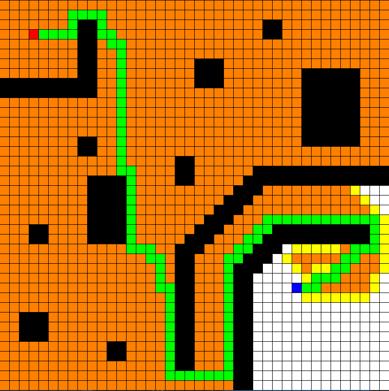

# Slither
A visual demonstration of a quick and efficient A* pathfinding implementation using pygame.

# Controls
- 🖱 Left Click: Place start and target nodes
- 🖱 Right Click: Place wall node
- ⌨ Space key: Find path between start and target nodes
- ⌨ Delete key: Clear node
- ⌨ Escape key: Reset grid

# Visuals
- 🟥 Starting node
- 🟦 Target node
- ⬛ Unpassable wall node
- 🟩 Path node
- 🟧 Visited node
- 🟨 Calculated node
- ⬜ Clear node

# Preview

